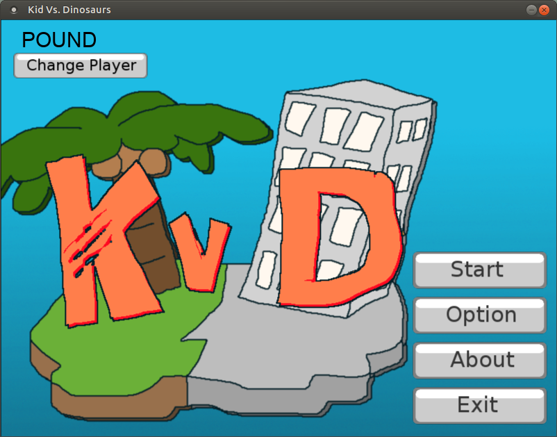
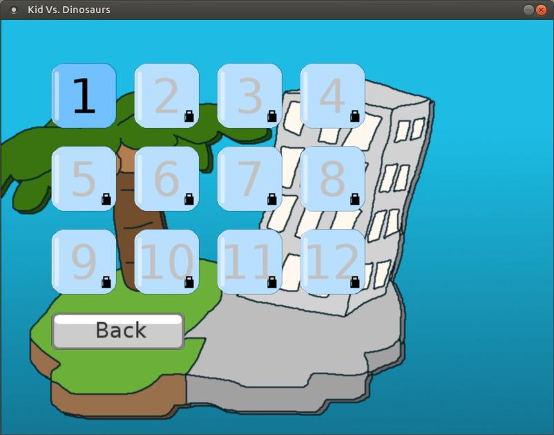
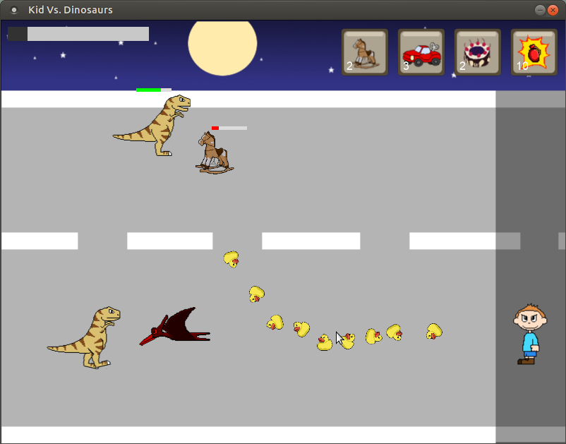

# KVD-Game
**KVD (Kid Vs Dinosaurs) is a game for Ubuntu/Linux** that I developed while I'm a senior at Kasetsart University (Kamphaeng Saen Campus)

## Development Environment & Tools
- **OS** : [Ubuntu 12.04.1 LTS](http://releases.ubuntu.com/12.04/)
- **Programming Language** : C++
- **Compiler** : GCC 4.4
- **Library** : [SFML 1.6](https://www.sfml-dev.org/download/sfml/1.6/)
- **IDE** : [Code::Blocks 10.05](http://www.codeblocks.org/)
- **Other Tools** : [GIMP 2.8](https://www.gimp.org/)
- **Free Sound Effects** : [SoundJay.com](https://www.soundjay.com/)

## Screenshots
### Start Screen

### Select Level

### Gameplay

